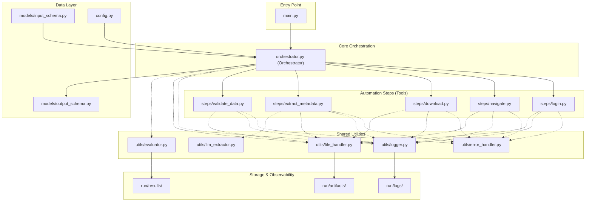

# Project Architecture - Invoice Automation Agent

This document outlines the high-level architecture and component interactions of the Invoice Automation Agent.

## System Architecture Diagram

## Component Breakdown

### 1. **Entry Layer (`main.py`)**
- Serves as the primary interface for users.
- Loads configuration and triggers the execution via the Orchestrator.
- Outputs final summaries and metrics to the console.

### 2. **Orchestration Layer (`orchestrator.py`)**
- The "Brain" of the project.
- Coordinates the sequence of steps: **Login → Navigate → Download → Extract → Validate**.
- Manages state, handles high-level errors, and tracks performance metrics (Day 13).
- Ensures browser sessions are shared across steps for efficiency.

### 3. **Step Layer (`steps/`)**
- **Login**: Handles authentication, profile selection, and MFA if needed. Includes fallback logic for different UI layouts.
- **Navigate**: Traverses the portal to find the invoice list. Filters by date/period.
- **Download**: Intercepts file streams or clicks export buttons to save PDF invoices.
- **Extract**: Uses AI (Azure OpenAI) to pull structured data (Date, Amount, Vendor) from raw PDFs.
- **Validate**: Applies business rules (Day 11) to ensure extracted data is accurate and complete.

### 4. **Utility Layer (`utils/`)**
- **ErrorHandler**: Provides the `@retry_on_failure` decorator and standardized error objects.
- **FlowEvaluator**: Records every run and tool call into CSV files for dashboarding.
- **FileHandler**: Manages the structured artifact directory (`run/artifacts/run_id/`).
- **FlowLogger**: Provides rich, multi-level logging to both console and files.

### 5. **Data Layer (`models/` & `config.py`)**
- **Schemas**: Strict Pydantic-style models for input and output contracts to ensure data integrity.
- **Configuration**: A centralized file for portal URLs, credentials, timeouts, and retry policies.

## Key Features for Presentation

1.  **Robustness**: Built-in retry mechanisms and UI fallbacks (Day 12).
2.  **Accuracy**: Advanced LLM-based extraction with multi-layer validation (Day 11).
3.  **Observability**: Full traceability with tool-level timing and aggregate performance metrics (Day 13).
4.  **Security**: Support for masked logging and structured file handling.
